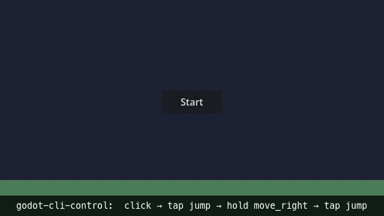

<div align="center">

# Godot CLI Control

**Drive a running Godot 4 scene from Python, pytest, a shell, or an AI agent — over a localhost WebSocket.**

Click nodes. Read & write properties. Simulate input. Take screenshots. Record movies. Black-box test a game without recompiling it.

[](https://pypi.org/project/godot-cli-control/)
[](https://pypi.org/project/godot-cli-control/)
[](https://godotengine.org/)
[](https://github.com/ClaymanTwinkle/godot-cli-control/actions/workflows/ci.yml)
[](LICENSE)

[**▶ Runnable demo — `examples/platformer-demo` →**](examples/platformer-demo)

</div>

<p align="center">
  
</p>

---

## Why

Godot ships great tools for *playing* a scene, but very little for *programmatically poking it from outside*. If you want CI to assert that "the boss spawns after the third hit," or you want an AI agent to navigate a menu, or you want a pytest run to drive an animated character through 200 frames and diff the screenshot — you typically end up writing a one-off in-engine harness per project.

`godot-cli-control` is that harness, generalized:

- It's a **plugin** that drops into `addons/` and exposes a JSON-RPC server bound to `127.0.0.1`.
- It's a **Python client + CLI** (`pipx install godot-cli-control`) that talks to that server.
- It's a **pytest plugin** so test files just declare `bridge` and go.
- It's an **agent integration** — `init` writes Claude Code / Codex skills so AI tools immediately know your scene's automation surface.

One install, one daemon, one consistent API across your editor, your tests, your CI, and your agents.

## Highlights

| | |
|---|---|
| **One-shot onboarding** | `godot-cli-control init` copies the addon, patches `project.godot`, autodetects the Godot binary, and writes AI-agent skill files. Idempotent. |
| **Shell is canonical**  | 30+ subcommands cover the full RPC surface; output is single-line JSON envelope by default (`--text` for legacy strings). `GameClient` (async) / `GameBridge` (sync) are still there when you need to keep one connection across many steps. |
| **pytest fixtures**     | Auto-loaded `godot_daemon` (session) + `bridge` (function) fixtures, plus opt-in `fresh_scene` (per-test scene reload) and `no_push_errors` (fail on silent `push_error`). Held inputs / pause / time-scale restored between cases; failures auto-screenshot. |
| **Deterministic waits** | `wait-prop` / `wait-signal` / `wait-frames` / `pause` + `step-frames` / `time-scale` — assert on real engine state instead of sleeping and hoping. |
| **AI-agent ready**      | `init` ships `.claude/skills/.../SKILL.md` and `.codex/skills/.../SKILL.md` pinned to your installed CLI version. Includes exit-code semantics, error code reference, and JSON envelope contract. |
| **Headless or GUI**     | Runs under `--headless` for CI, or with a real window for visual debugging. |
| **Cross-platform**      | Linux, macOS, and native Windows (no WSL). |
| **Safe by default**     | Localhost-only bind, OFF unless explicitly activated, release builds always disabled, property/method blacklist. |

## Quickstart

```bash
# 1. Install the CLI (it bundles the Godot plugin source)
pipx install godot-cli-control

# 2. From your Godot project root: copy plugin, patch project.godot, detect Godot binary
cd path/to/your_godot_project
godot-cli-control init

# 3. Start the daemon and try it
godot-cli-control daemon start
godot-cli-control tree 3
godot-cli-control screenshot /tmp/x.png
godot-cli-control daemon stop
```

Want unreleased main? `pipx install "git+https://github.com/ClaymanTwinkle/godot-cli-control.git"`.

## Try the demo

A self-contained example lives in [`examples/platformer-demo/`](examples/platformer-demo) — a tiny scene with a **Start** button and a jumping character, plus a `drive.sh` that walks it end to end (init → daemon → click → simulate input → read state back → screenshot). Clone the repo, then:

```bash
cd examples/platformer-demo
./drive.sh
```

It's driven under a real (headless) Godot in CI, so it can't silently rot.

## A taste

**From Python, async:**

```python
import asyncio
from godot_cli_control import GameClient

async def main():
    # Omitting port lets GameClient auto-discover from .cli_control/port (written by daemon start)
    async with GameClient() as client:
        await client.click("/root/Game/StartButton")
        await client.action_press("jump")
        await client.wait_game_time(0.5)
        await client.action_release("jump")
        png = await client.screenshot()
        open("frame.png", "wb").write(png)

asyncio.run(main())
```

**From pytest (fixtures auto-loaded — no `conftest.py` boilerplate):**

```python
def test_jump(godot_daemon, bridge):
    bridge.click("/root/Game/Start")
    bridge.tap("jump")
    assert bridge.get_property("/root/Player", "on_floor") is False
```

**From a shell or wrapper script — same surface, JSON by default for AI agents:**

```bash
godot-cli-control daemon start --headless
godot-cli-control click /root/Game/StartButton
godot-cli-control tap jump
if godot-cli-control exists /root/Game/Boss; then
  godot-cli-control get /root/Game/Boss hp | jq .result   # → 100
fi
godot-cli-control screenshot frame.png
godot-cli-control daemon stop
```

Pass `--text` (or `--no-json`) to switch back to legacy human-readable output.

## How it fits together

```
┌────────────────────────────────────┐                ┌────────────────────────────────────┐
│  Your tooling                      │                │  Your Godot 4 project              │
│                                    │   WebSocket    │                                    │
│   ┌──────────────────────────┐     │   JSON-RPC     │   ┌────────────────────────────┐   │
│   │ godot-cli-control CLI    │     │   127.0.0.1    │   │ addons/godot_cli_control/  │   │
│   │ GameClient   (async)     │ ◄──────────────────► │   │   GameBridgeNode autoload  │   │
│   │ GameBridge   (sync)      │     │   :<port>      │   │   LowLevelApi              │   │
│   │ pytest fixtures          │     │   (auto)       │   │   InputSimulationApi       │   │
│   └──────────────────────────┘     │                │   └────────────────────────────┘   │
└────────────────────────────────────┘                └────────────────────────────────────┘
```

`<port>` is OS-assigned by default; the actual value is written to `.cli_control/port` when the daemon starts. CLI subcommands and `GameClient()` (no port arg) auto-discover it from there.

The plugin is **off by default** even when enabled — see [Activation modes](addons/godot_cli_control/README.md#activation-modes). The server binds `127.0.0.1` only; PID/port files are mode `0600`; release builds are unconditionally disabled. See [Security model](addons/godot_cli_control/README.md#security-model).

## Use cases

- **Black-box automated testing.** Drive your scene from pytest, assert on properties.
- **CI visual regression.** Screenshot a known state, diff against a golden PNG.
- **Demo recording.** Run a script that walks the scene, record a movie via Godot's Movie Maker (GUI mode).
- **AI agents.** Claude Code / Codex pick up the SKILL.md and can immediately operate your scene.
- **Bug repros.** Capture a sequence of inputs in a script and replay deterministically.

## API at a glance

Every RPC has both a CLI subcommand and a `GameClient` method — pick whichever fits your harness. Default output is a JSON envelope (`--text` for legacy strings).

| Category | CLI | GameClient |
|---|---|---|
| Scene tree | `tree`, `children`, `exists` | `get_scene_tree`, `get_children`, `node_exists` |
| Inspection | `get` (multi-prop = atomic same-frame read), `text`, `visible`, `sprite-info` | `get_property`, `get_properties`, `get_text`, `is_visible`, `sprite_info` |
| Mutation   | `set`, `call`, `click` | `set_property`, `call_method`, `click` |
| Input      | `press`, `release`, `tap`, `hold`, `combo`, `combo-cancel`, `release-all`, `pressed`, `actions` | `action_press`, `action_release`, `action_tap`, `hold`, `combo`, `combo_cancel`, `release_all`, `get_pressed`, `list_input_actions` |
| Waiting    | `wait-node`, `wait-prop`, `wait-signal`, `wait-frames`, `wait-time` | `wait_for_node`, `wait_property`, `wait_signal`, `wait_frames`, `wait_game_time` |
| Scene isolation | `scene-reload`, `scene-change` | `scene_reload`, `scene_change` |
| Time control | `time-scale`, `pause`, `unpause`, `step-frames` | `time_scale`, `pause`, `unpause`, `step_frames` |
| Render     | `screenshot` (path required, `--node` crops to a node's screen rect) | `screenshot` |
| Diagnostics | `errors` (structured `push_error` log, Godot 4.5+), `daemon logs` | `errors` |

Full RPC reference (signatures, error codes, blacklist): [plugin README](addons/godot_cli_control/README.md#rpc-reference). Output contract & exit codes: see the AI Quickstart in any project's `.claude/skills/godot-cli-control/SKILL.md`.

## Repository layout

```
godot-cli-control/
├── addons/godot_cli_control/   # Godot 4 plugin (drop into your project's addons/)
├── python/                     # Python client + CLI (pip-installable)
├── examples/platformer-demo/   # runnable demo (clone-and-run + hero-GIF source)
└── .github/workflows/          # CI + release packaging
```

Each subdirectory has its own README:

- [`addons/godot_cli_control/README.md`](addons/godot_cli_control/README.md) — plugin install, RPC reference, activation modes, security model, known limitations
- [`python/README.md`](python/README.md) — Python `GameClient` / `GameBridge` API + CLI usage + pytest fixtures

## Agent integration

When `godot-cli-control init` runs, two skill directories are dropped under your Godot project root:

- `.claude/skills/godot-cli-control/` (Claude Code)
- `.codex/skills/godot-cli-control/` (Codex)

Each contains a lean `SKILL.md` core (quickstart, exit codes, command catalogue, top pitfalls — what an agent needs in-context on every session) plus `references/*.md` detail files (full command semantics, error-code tables, recording recipes, pytest fixtures) that agents read on demand — so triggering the skill costs a few hundred lines of context instead of the full manual. Both trees render from the same template and pin the current CLI version; for exact per-command flags agents run `godot-cli-control <cmd> -h` live. After upgrading the CLI (`pipx upgrade godot-cli-control`), refresh both with:

```bash
godot-cli-control init --skills-only
```

Re-running plain `godot-cli-control init` also works and additionally refreshes the bundled `addons/godot_cli_control/` plugin to the new version (pass `--keep-addon` if you've deliberately modified your copy).

If you've hand-edited a `SKILL.md` and want to keep your version:

- `godot-cli-control init --no-skills` — skip skill writes entirely going forward
- `godot-cli-control init --skills-no-clobber` — keep existing files, only fill in missing ones

The two `--no-*` flags are mutually exclusive with each other; `--skills-no-clobber` is orthogonal and may be combined with `--skills-only`.

> Optional: add `.claude/` and `.codex/` to your project's `.gitignore` if you don't want the skill files committed. They are reproducible at any time via `godot-cli-control init --skills-only`.

## Manual install (advanced)

If you don't want `init`, copy the plugin manually and enable it from the editor — see the [plugin README](addons/godot_cli_control/README.md#manual-setup-if-you-prefer) for the long-form walkthrough. The legacy wrappers (`bin/run_cli_control.sh` / `.ps1`) are kept as compatibility shims but **deprecated since 0.1.6 and scheduled for removal in 0.3.0** — new code should call `godot-cli-control <subcommand>` directly.

## Recent changes

- **Wait primitives:** `wait-prop` (poll a property until it matches, with `--op` / `--tolerance`), `wait-signal` (arm before triggering), `wait-frames` (deterministic frame advance) — replace sleep-and-hope polling.
- **Scene isolation:** `scene-reload` / `scene-change` block until the new scene is ready; the pytest `fresh_scene` fixture gives each test a pristine scene.
- **Time control:** `time-scale` (read/write `Engine.time_scale`), `pause` / `unpause`, and `step-frames` for deterministic stepping while paused.
- **Visual-state assertions:** `sprite-info` aggregates a sprite's render state (effective atlas region, frame, flips, modulate) in one call; `screenshot --node` crops to a node's screen rect for pixel-level asserts.
- **Diagnostics:** `errors` queries structured `push_error` / `push_warning` logs with a cursor (Godot 4.5+); `daemon logs --tail N` reads the daemon log even post-mortem; pytest gains `no_push_errors` (fail on silent errors) and automatic failure screenshots.
- **BREAKING (0.2.x):** `get` returns compound Variants (Vector2, Color, …) as `{"value": [x, y], "type": "Vector2"}` instead of the old `"(x, y)"` string — the `value` layout round-trips into `set`. `get <path> <prop1> <prop2>` reads multiple properties atomically in one frame.

Full history: [`CHANGELOG`](addons/godot_cli_control/CHANGELOG.md).

## Status

Alpha. Published on PyPI (`pipx install godot-cli-control`); Godot AssetLib submission pending ([#18](https://github.com/ClaymanTwinkle/godot-cli-control/issues/18)). Current version: see [`CHANGELOG`](addons/godot_cli_control/CHANGELOG.md).

## Roadmap

Tracked in [issues](https://github.com/ClaymanTwinkle/godot-cli-control/issues). Remaining open headline items:

- AssetLib first submission ([#18](https://github.com/ClaymanTwinkle/godot-cli-control/issues/18))

## Contributing

Issues and PRs welcome. The plugin's GUT unit tests run via `./addons/godot_cli_control/tests/run_gut.sh` (bash) or the cross-platform `python addons/godot_cli_control/tests/run_gut.py` (what CI uses) — both require `GODOT_BIN`. The Python package's tests run via `pytest` from `python/`. CI matrix covers Linux, macOS, and Windows.

## License

MIT — see [`LICENSE`](LICENSE).
